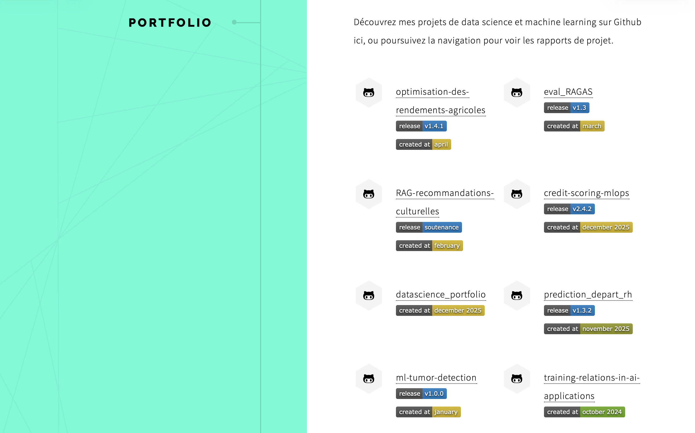

# github_metadata (Nikola plugin)

Expose a `github` namespace to Nikola templates, similar to `site.github` in
jekyll-github-metadata. The plugin can fetch public repos for a user, or use a
manual list defined in `conf.py`.



## Install

Copy the plugin folder into your Nikola site:

```text
your_site/
  plugins/
    github_metadata/
      github_metadata.py
      github_metadata.plugin
      README.md
      conf.py.sample
      requirements.txt
```

## Plugin files

- `README.md` (this file)
- `github_metadata.py` (plugin code)
- `github_metadata.plugin` (Nikola/Yapsy metadata)
- `conf.py.sample` (sample configuration)
- `requirements.txt` (Python dependencies, currently `certifi`)

## Configuration (conf.py)

Minimal config (public repos for one user):

```python
GITHUB_METADATA = {
    "public_repositories": {
        "enabled": True,
        "user": "your_github_user",
    }
}
```

Full config (API + cache + filters, unauthenticated):

```python
GITHUB_METADATA = {
    "enabled": True,
    "inject_as": "github",
    "api_url": "https://api.github.com",
    "cache_ttl": 3600,

    # Optional: add github.repository
    # "repository": "owner/repo",

    "public_repositories": {
        "enabled": True,
        "user": "your_github_user",
        "sort": "pushed",
        "direction": "desc",
        "include_forks": False,
        "include_archived": False,
        "limit": 200,
    },
}
```

Manual repos (no API call):

```python
GITHUB_METADATA = {
    "public_repositories": {
        "enabled": False,
        "user": "your_github_user",
    },
    "manual_repositories": [
        "owner/repo-1",
        "repo-2",  # will use user as owner
        {
            "name": "repo-3",
            "full_name": "owner/repo-3",
            "html_url": "https://github.com/owner/repo-3",
            "description": "Short description",
            "language": "Python",
            "stargazers_count": 0,
        },
    ],
}
```

## Template usage (Jinja)

```jinja

  <ul>
  
    <li><a href="{{ r.html_url|e }}">{{ r.name|e }}</a></li>
  
  </ul>

```

Optional single repo:

```jinja

  <a href="{{ github.repository.html_url }}">{{ github.repository.full_name }}</a>

```

`github.repository` is fetched only when `GITHUB_METADATA["repository"]` is set.

## What is injected

The plugin injects a dictionary under `GITHUB_METADATA["inject_as"]` (default
`github`) with:

- `api_url`
- `user_login`
- `repository_nwo` (only when `repository` is configured)
- `public_repositories` (list)
- `repository` (single repo, optional)
- `errors` (list of strings)
- `generated_at` (epoch seconds)

## Online example

- The following website use the Github Metadata plugin : [stephmnt/datascience_portfolio](stephmnt.github.io/datascience_portfolio)

## The repository

- [https://github.com/stephmnt/GitHub_metadata](https://github.com/stephmnt/GitHub_metadata)

## Notes

- The GitHub API is used when `public_repositories.enabled` is True.
- This plugin does not use tokens by design; any `token` setting is ignored.
- Cached responses are stored under `cache/` and expire after `cache_ttl`.
- `certifi` is installed via `requirements.txt` to improve SSL reliability.
- If you hit rate limits, use `manual_repositories` to avoid API calls.
