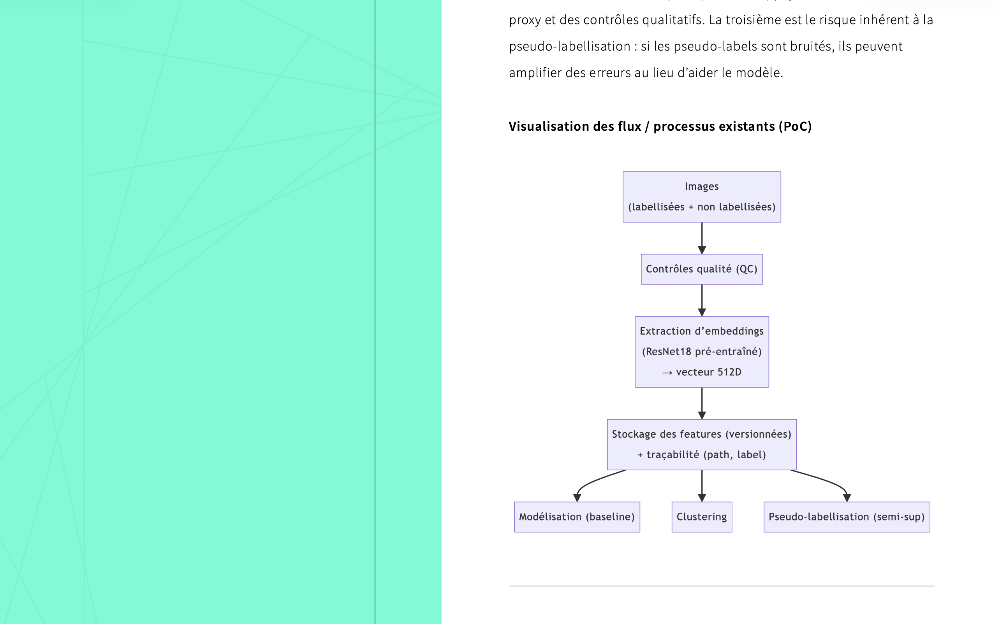

# mermaid (Nikola plugin)

Render Mermaid diagrams from Nikola shortcode blocks.

This plugin provides a `mermaid` shortcode that wraps diagram source code in a
`<div class="mermaid">` block and, by default, injects a guarded Mermaid.js
loader next to the diagram. It works without editing theme templates.



## Install

Copy the plugin folder into your Nikola site:

```text
your_site/
  plugins/
    mermaid/
      mermaid.py
      mermaid.plugin
      README.md
      conf.py.sample
      requirements-nonpy.txt
```

## Configuration

No Nikola configuration is required for the default behavior.

Optional configuration:

```python
MERMAID_CONFIG = {
    "auto_load": True,
    "cdn_url": "https://cdn.jsdelivr.net/npm/mermaid@10/dist/mermaid.min.js",
    "initialize": {
        "startOnLoad": False,
    },
}
```

Set `auto_load` to `False` if your theme already loads and initializes
Mermaid.js. When `auto_load` is enabled, the loader is protected by global
browser flags so multiple diagrams do not inject multiple Mermaid.js scripts.

## Usage

Use the shortcode in a post or page:

```markdown
{}
mindmap
  root((Data Scientist - ML))
    Analyse de donnees
    MLOps
    NLP et RAG
{}
```

You can pass a theme name through the shortcode:

```markdown
{}
graph TD
  A[Data] --> B[Model]
  B --> C[API]
{}
```

The selected theme is exposed as a `data-theme` attribute:

```html
<div class="mermaid" data-theme="dark">
...
</div>
```

## Online example

- The following website use the Github Metadata plugin : [stephmnt/datascience_portfolio](stephmnt.github.io/datascience_portfolio)

## Notes

- This plugin does not bundle Mermaid.js; it loads Mermaid.js from the configured
  CDN URL when `auto_load` is enabled.
- `requirements-nonpy.txt` declares Mermaid.js as a non-Python runtime dependency
  for the Nikola plugin index.
- If diagrams do not render, check the browser console, CDN access, and that the
  shortcode is closed with `{}`.
